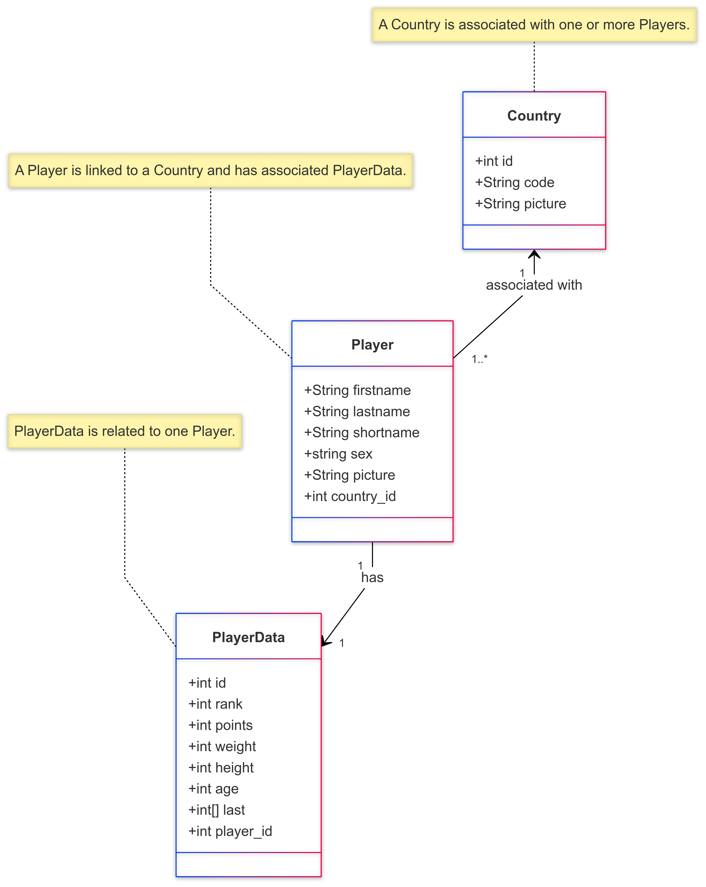

## Technologies

- NestJS avec typeORM
- SQLite

## Project setup

```bash
$ npm install
```

## Compile and run the project

```bash
# development
$ npm run start

# watch mode
$ npm run start:dev
```

## Run tests

```bash
# unit tests
$ npm run test
```

```bash
# pour exécuter les e2e tests, veuillez mettre NODE_DEV test dans le fichier .env
# e2e tests
$ npm run test:e2e
```

## Déploiement

Ce projet est déployé sur [Railway](https://railway.app). Vous pouvez y accéder en utilisant l'URL suivante :
https://tennis-api-production.up.railway.app

## API Documentation

La documentation complète de l'API est disponible via Swagger. Vous pouvez y accéder en utilisant l'URL suivante :
https://tennis-api-production.up.railway.app/api-docs

## Améliorations

- Modélisation :
  J'ai choisi SQLite pour sa simplicité, pour respecter le format de données que vous m'avez donner et parce qu'une seule entité suffisait pour stocker toutes les données nécessaires à ce stade du projet.
  Cependant, à l'avenir, je prévois de migrer vers une base de données MySQL et de structurer les données en trois entités Player, Country et PlayerData avec des relations bien définies(expliquées dans le diagramme suivant).
  Cette approche permettra de mieux gérer des volumes de données plus importants et d'assurer une scalabilité optimale.



- Utilisation d'un Dockerfile et Docker Compose pour standardiser l'environnement, éviter les problèmes de versions, et gérer les services, comme la base de données, de manière isolée et reproductible.
