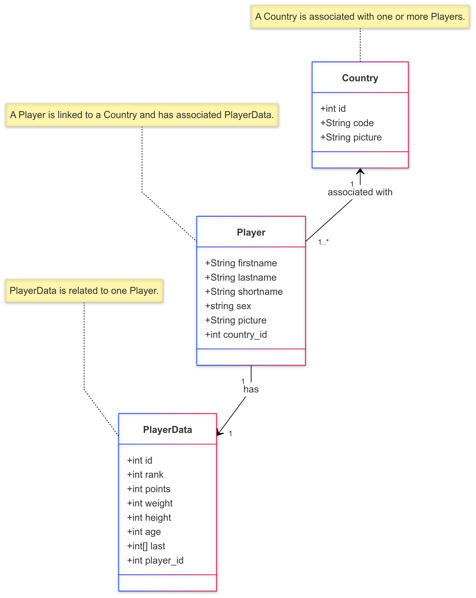

# Tennis API

A REST API for managing tennis player rankings and statistics, built with NestJS and TypeORM.

🚀 **Live demo:** https://tennis-api-production.up.railway.app
📄 **Swagger UI:** https://tennis-api-production.up.railway.app/api-docs

## Tech Stack

- **NestJS** with TypeORM
- **SQLite** — lightweight storage, single-entity model
- **Swagger** — auto-generated API documentation
- **Railway** — cloud deployment

## Getting Started

```bash
npm install
npm run start:dev
```

## Running Tests

```bash
# Unit tests
npm run test

# E2E tests (requires NODE_ENV=test in .env)
npm run test:e2e
```

## Design Decisions & Improvements

### Current Data Model

SQLite was chosen for its simplicity and to match the provided data format. A single entity covers all the data needed at this stage.

### Planned Migration

For production scale, the architecture would move to **MySQL** with three normalized entities — `Player`, `Country` and `PlayerData` — with well-defined relationships to handle larger data volumes and ensure scalability.



### Infrastructure

Adding a **Dockerfile and Docker Compose** setup would standardize the environment, prevent version conflicts, and isolate services like the database for reproducible builds across dev, staging and production.
